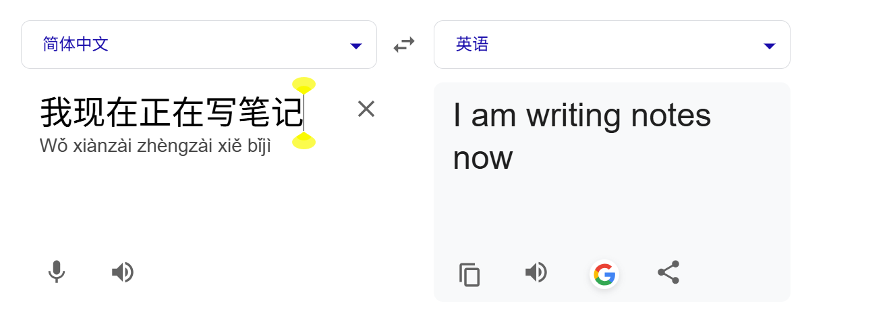
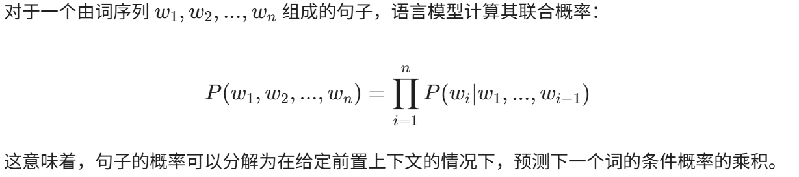

# LLM学习杂记

## chapter 1. NLP

### 1.1 what is NLP？

自然语言处理（Natural Language Processing，NLP），旨在能够使计算机能够理解和处理人类所使用的高级自然语言（汉语、英语、日语、俄语等），实现人机无缝交流和互动。所以就要求计算机能够识别和处理语言的表层结构，语言背后的深层含义，比如语义、语境、情感等复杂的因素。因为鄙人目前只想看看当今基于深度学习方法的NLP技术，对于统计方法以及更古老的方法就不记录了。

### 1.2 NLP任务

**机器翻译**：就比如把英语翻译成汉语，把汉语翻译成日语等，实现机器帮助我们翻译句子，解释意思，可以使未学习另一门语言的人也能够利用机器翻译来实现一些日常翻译。好的机器翻译应该能够“完整”、“详细”翻译原始文本，比如原始文本背后的语义、语境、情感也能够表达出。

**中文分词**：因为中文的句子都是词与词紧邻，不像英语的词与词之间有空格分隔，所以将连续的中文文本切分分隔为有意义的词汇序列。

**词性标注**：目标是为文本中的每一个单词分配一个词性标签，比如名词、形容词、动词、介词等，这样可以使计算机更好翻译或更好理解文本的含义。

**文本分类**：把原始文本自动分配到预定义的类别中。比如有情感分类，给出一段原始文本，把该原始文本分类为开心、伤心、抑郁、愤怒这四个情感中。

**命名实体识别**：Named Entity Recognition，NER。目标是自动识别原始文本中具有特定意义的实体。

**文本摘要**：概括原始文本的主要内容，生成一段简要但主要的摘要。

NLP任务还有很多，这里就不一一记了，鄙人也不是搞自然语言处理的，兴趣使然想要玩一个LLM，想自己手动搓一个LLM出来，鄙人目前研究生从事更多偏向于计算机视觉。不一一赘述了。

### 1.3 文本表示

文本表示其实就是将原始文本映射到实向量的技术，也叫词嵌入。

**词向量**：向量空间模型，将原始文本（词根、单词、句子、段落或整个文档）转换为高维空间中的向量在计算机中的数字化表示。包括one-hot编码（极其稀疏）、分布式表示（稠密连续），其中分布式表示是现代词向量的核心思想。

**语言模型**：是计算一串词序列出现概率的统计语言模型。其数学表达如下

语言模型本身不是词向量，它是训练词向量的。现代深度学习发现，强迫神经网络去执行“预测下一个词（完形填空）”的任务，网络内部的权重参数会自动学习到语法、句法和文本内置知识。训练好的语言模型，其中间产物就是高质量的文本表示。

**Word2Vec**：静态语义表示，只在“训练”时作用，虽然能够结合上下文来生成具有语义的词向量表示，但训练完后，最终的产物就是一个固定的词汇向量矩阵，词向量表示就固定了，推理时还是只有一种静态语义。推理时就直接查表，去取到词向量的表示。

**ELMo**：动态语义，基于双向长短期记忆网络（Bi-LSTM），具有序列建模的能力。训练和推理时都作用，训练完后，最终的产物是一个神经网络模型。推理时，把原始文本输入网络做一次前向传播计算，训练和推理时都强制依赖全局上下文。

关于这里的Word2Vec与ELMo的区别：为什么不直接使用word2vec的神经网络呢？因为word2vec的神经网络结构极其简单，可以自己在网上看看word2vec的网络结构，没有序列建模能力，所以word2vec得到的词嵌入只能使用他的结果，得到一个词向量表。而ELMo的神经网络具有序列建模能力，可以在训练和推理时都要使用他的神经网络结构，来得到文本表示。