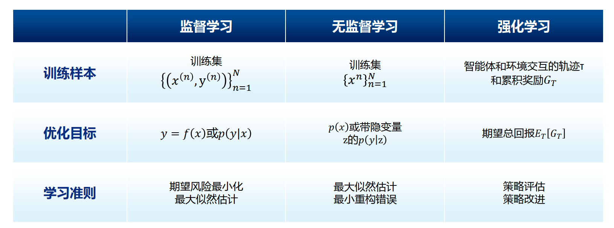
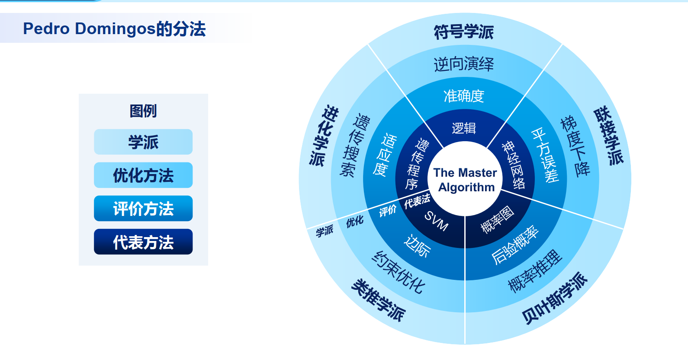
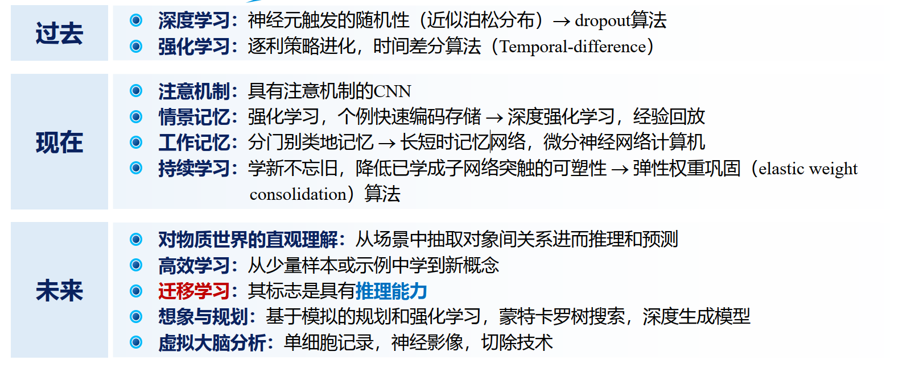
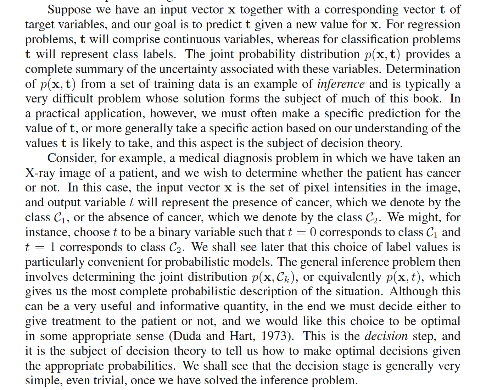
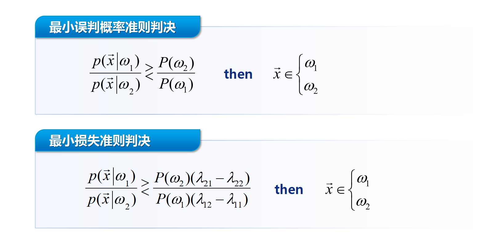
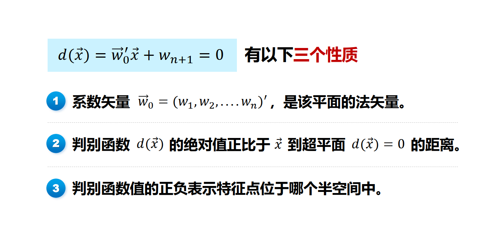
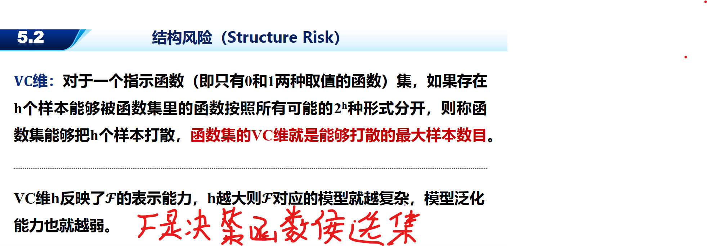
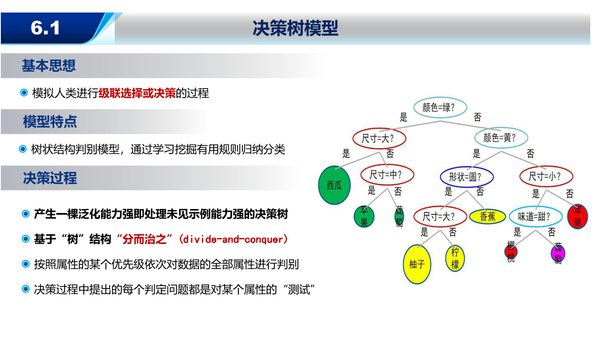
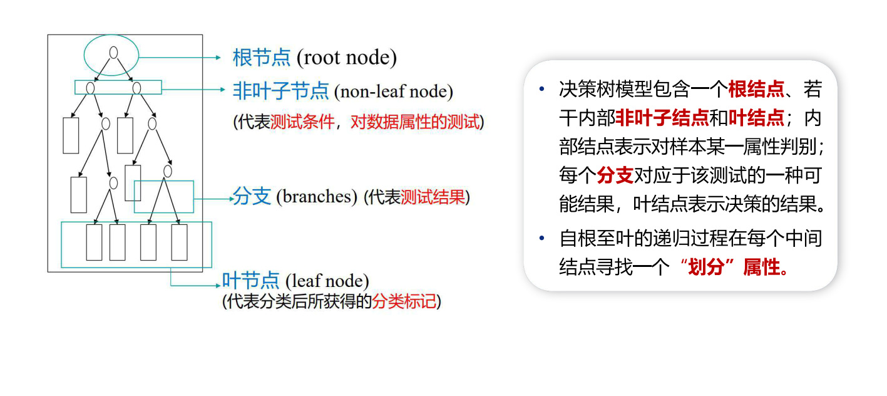

# Pattern Recognition and Machine Learning（PRML）

该学科的基础与内涵包含的太多了：哲学、数学、经济学、统计学、神经科学、心理学、计算机科学、控制论、信号处理、语言学、因果推断、最优化理论等等。

 version1Thinking：研究生还有时间学课？不都去搞论文和课题了吗？但是我想着这基础理论还是应该有用的吧，我也不知道自己能写多少，写多少算多少吧。

## chapter1.绪论

### 1.1.PRML基本概念

#### 1.1.1模式识别

是模式分类的方法，也就是确定一个样本的“类别属性”的过程。常用的术语有模式空间（实体对象）、特征空间（特征向量）、类别空间（类别）。记住“模式”是数据或者所有样本的潜在和内部的规律、结构或者关系，是模式识别的目标，我们算法的目的就是为了发现这些数据中的抽象规律（模式），而使得能够根据这个“模式”来“识别”物体，识别物体是什么（分类和回归皆可）、属于什么。不要只认为模式识别只是分类任务，还包括回归。

所以我们要怎么确定“算法”来找出隐藏在数据中的“模式”，正是模式识别需要完成的工作。那通过数据的什么属性（特征）来找出潜在的“模式”呢？这就需要数据的特征选取了，需要人工手动选取特征（不同于深度学习的端到端自动寻找特征，只需要关注网络的结构、损失函数等，而不需要关注特征选取）。

**模式空间**：所有样本观测数据构成的空间（可以简单理解为所有的样本的实体）。

**特征空间**：特征矢量构成的空间。每个样本是特征空间的一个点，点的位置（比如x，y，z，u，...坐标）就是由该样本的特征值来确定，每个坐标就是样本的一个特征。所以一般特征空间的维数远远小于模式空间的维数。

**类空间**：根据适当的判决规则，把特征空间划分成不同的子空间，不同的子空间属于不同的类别，子空间就可以理解为类空间。

模式识别系统框图：

如上面所说，可以发现模式识别的核心问题就是**“特征的提取与选择”以及“学习训练算法”**。

#### 1.1.2机器学习

A computer program is said to learn from experience E with respect to some class of tasks T and performance measure P if its performance at tasks in T, as measure by P, improves with experience E. 也就是说从经验E中提高完成某任务T的性能P的方法（自动从经验中学习，提高某任务的性能指标的方法）。

#### 1.1.3机器学习的分类与流派

1.分类

机器学习分类

2.流派

#### 1.1.4机器学习发展趋势

### 1.2.PRML的基本原则

1.No have Launch（没有免费的午餐定理）：

一个算法在这个方面表现比较好，但在另一方面不一定表现好，总会因为考虑重要的方面而舍去了在另一些方面的最优。即没有一个算法能够解决所有的方面，总会有该算法有失偏颇的方面，可谓鱼和熊掌不可兼得。

2.Ugly Duckling Theorem（丑小鸭定理）：

在纯粹的逻辑和数学角度看，一只丑小鸭和一只白天鹅的相似程度，与两只白天鹅之间的相似程度一摸一样。表达的意思就是说不存在绝对“客观”的分类，如果我们对一个事物的所有特征一视同仁都考虑，万物皆相同。

而模式识别与机器学习能起作用，正是我们使用算法引入了“偏见”，我们认为某些特征比其他不必要的特征更重要（重要的特征赋予权重更高，不重要的特征赋予权重很小甚至为0不考虑）以及输入与输出可能满足线性关系（线性分类和线性回归时）等。

3.Occam‘s Razor Theorem（奥卡姆剃刀原理，也叫最小描述原理）：

简单来说就是八个字，如无必要，勿增实体。针对同一个现象有不同的解释，在没有更多的证据的情况下，我们应该优先选择最简单、预设条件最少、复杂度最低的那一个解释。因为最简单的那一个解释更容易被测试、被证伪（科学真理不是要能够证明它是对的，而是需要证伪）。也就是不要一味追求算法或模型的复杂度，应当在你所训练的数据集大小与算法模型复杂度之间有个折中。

### 1.3.随机及信息论基础

在关于这一节开始前，我只是想说“**随机随机**”，在你推导与实验前，先搞明白哪个是随机的？连哪个随机都没有搞明白（张灏老师还说过，那就...，我忘了），那做下去可能会到处是歧义，意义表征不明确，乱碰，乱搞。这一节包括的知识有概率论、统计、随机过程、决策论、信息论，不过我也不可能全部都记录和写下来，只是挑选重点，这涉及的科目中除了概率论稍微简单点，其余都是比较难的科目。

关键词：概率（密度）、条件概率（密度）、似然函数（类概率）、先验概率（密度）、后验概率（密度）、马尔可夫链、probabilistic graphic model（概率图模型）

**条件概率**中的条件是已经发生的并且观测到的事实。

#### 1.3.1随机与概率基础

1.对于联合概率与条件概率分不清楚物理意义。记住条件概率中的条件是已经观测到的事实，是已经确定了的，条件概率本质是已知线索后对信念的更新，是观测后的推断。而联合概率中的变量都是随机的，还未确定的。而且，联合概率中的变量是同时发生，无因果关系，还给出了最完整的概率描述，是**所有信息的源头**。一般的推断问题就是确定联合分布，联合分布提供了变量相关的不确定性的完整总结。

对于想生成数据，就关注联合分布；想做决策分类，就关注条件分布。

2.类（预测值）概率通常可以理解为就是似然函数（likelihood）。后验分布（Posterior）实质意思就是说条件确定后（看到某个数据后），对参数的信念更新。

3.公式（1）充分体现了贝叶斯对于“参数（模型）“信念更新，以及把”参数“作为一个随机变量的不确定性描述。不像频率学派的最大似然，把参数$w$作为一个固定的常数看待。在贝叶斯框架下，我们不知道$w$是多少，所以当作随机变量处理，要考虑所有可能的$w$，也就是要考虑它的后验分布了。
$$
p(t_{new} | x_{new}, D) = \int p(t_{new} | x_{new}, w) p(w | D) dw
\\ \text{D是数据集}
$$
公式(1)的含义是：对于每一个可能的模型$w$，他会对预测结果$t_{new}$给出一个预测分布$p(t_{new}|x_{new},w)$，使用后验分布$p(w|D)$​作为权重，每个预测分布对$w$进行加权并求和，得到最终的预测分布。

4.关于处理数据时，维度太高使用定性思维可能会产生维度灾难（curse of dimensionality）。那唯独太高怎么处理呢？不用急，有个流形假设（Manifold Hypothesis），虽然数据分布在高维空间中，但是在现实生活中实际上有用的只分布在低维的流形上，也就是说真实需要用的数据只占高维空间中很小的一部分（一个低维结构嵌入在高维空间中）。

5.posterior ∝ likelihood × prior 。后验分布与似然函数、先验分布成正比。

#### 1.3.2贝叶斯决策准则

**1.最小误判概率准则**（最大后验概率准则）：

对于两类$ω_1$，$ω_2$问题
$$
\text{若 } P(\omega_1 \mid \vec{x}) > P(\omega_2 \mid \vec{x}) \text{ 则 } \vec{x} \in \omega_1 
\\
\text{若 } P(\omega_1 \mid \vec{x}) < P(\omega_2 \mid \vec{x}) \text{ 则 } \vec{x} \in \omega_2
$$

$$
P(\omega_i \mid \vec{x}) = \frac{P(\vec{x} \mid \omega_i) P(\omega_i)}{p(\vec{x})}
= \frac{P(\vec{x} \mid \omega_i) P(\omega_i)}{\sum_{i=1}^2 p(\vec{x} \mid \omega_i) P(\omega_i)}
$$

其中$P(\vec{x} \mid \omega_i)$也叫做似然函数（likelihood function of class $\omega_i$）。

**2.最小化预期损失**（最小化平均损失）：

损失函数（成本函数）、效用函数、损失矩阵

不管是分类还是回归问题，在不确定的世界中，我们都采用最小化期望损失来做最优决策，这两个任务都遵循公式4的原则：
$$
\text{Optimal Decision} = \arg \min_{\text{action}} \left[ E[\text{Loss} \mid \text{observation}] \right]
$$
1.代价与概率结合起来，做出真正的理性决策，而不是盲目的追求正确度。

2.关于贝叶斯公式中既有离散又有连续的随机变量时，概率密度与概率都会出现，毕竟离散的是采用概率，连续的采用概率密度，连续的概率为0.

3.我们做决策绝对不是简单的二选一（不是非黑即白，当然定性简单分析时可以这样，但是在真正的理性决策复杂决策中时不是非黑即白）。我们使用的决策最小化预期损失准则等决策准则，都是给了阈值范围（一维、二维或高维），如果算出的似然比（或其他指标计算）在某个阈值的范围，就选取在该阈值范围的决，如果未落在该决策的阈值范围，不是取它的相反决策。因为决策可能是好几个，也有可能拒绝决策（啥都不决策，这样的损失也有可能最小，就像买电视时一样，你可以选择买海信的、小米的、创维的及TCL的，但是我也可以一个都不选择，这样的损失最小，没有电视不影响我生活吧）。

4.一定要分清什么时候条件概率什么时候联合概率，而且联合概率确实是最重要的，知道联合概率就知道了其他所有的相关概率。

5.在做分类决策时，我们无法得知真实的类别，但可以控制决策$α_j$​​来最小化期望损失。

最小错误率和损失总结图

**3.最小最大损失准则**

在先验概率未知或者会产生变化的情况下，作最坏的打算，争取最好的决策结果。也可以理解为在最不利先验概率条件下的贝叶斯最优决策。

在所有可能的先验条件下，找出可能出现的最差情况（最大风险），之后找出最小的最大风险，即为最优决策。

**4.Neyman-Pearson准则**

和上个学期学的统计里面的功效函数、最大功效检验（即先确定一个第一类或者第二类错误的概率，之后寻找在确定后的这个错误概率下另一个错误的概率最小）、NP引理其实没多大区别。

#### 1.3.3贝叶斯估计与贝叶斯学习（参数估计）

已知数据的分布类型（高斯、伯努利、超几何、泊松等），把参数作为一个随机变量看待，并引入先验知识，去更新我们的信念。一般假设时采用共轭先验。

**1.贝叶斯估计**

贝叶斯公式定性分析：
$$
\text{后验}=\frac{\text{似然}\times\text{先验}}{\text{证据（归一化常数）}}
$$
贝叶斯估计就是把参数θ当作随机变量看待，之后确定一个损失函数，使得后验期望损失最小的θ即为最优的贝叶斯估计。

在平方损失函数下，使后验期望损失最小的θ就是后验均值；0-1损失下，则为MAP最大后验估计。当然其实我们也知道，在数据量多的时候贝叶斯估计是和最大似然估计趋近相同，但是在数据量少的时候贝叶斯估计的不确定性度量带来的结果可解释性、在线学习（有新数据输入时）友好、提供了正则化及融入了先验知识。记得大三还是大四的时候，就是这样想的，数据量多直接最大似然，数据量少就贝叶斯估计。

**2.贝叶斯学习**

估计整个分布的概率密度。首先主要关注的是”参数空间“。

- 前提：假设数据服从某个参数化模型，如 $x \sim p(x \mid \theta)$  
  - 例如：$x \sim \mathcal{N}(\mu, \sigma^2)$，其中 $\theta = \mu$  

- 目标：给定数据 $D$，推断 $\theta$ 的分布：  

  $$
  p(\theta \mid D) = \frac{p(D \mid \theta)p(\theta)}{p(D)}
  $$

- 输出：一个关于 $\theta$ 的概率分布（如后验均值、置信区间）  

- 最终用途：用于预测新数据：  

  $$
  p(x_{\text{new}} \mid D) = \int p(x_{\text{new}} \mid \theta)p(\theta \mid D) \, d\theta
  $$

---

**本质**：在已知模型结构下，对 **参数不确定性** 进行推理。

#### 1.3.4 概率的窗函数估计法（非参数估计）

未知数据的分布类型（而且不一定是常规分布），使用数据估计概率分布。这里的概率分布指的是数据的总体概率密度，对观测变量进行的分布估计，关注的是“数据空间”。在无模型假设下，对数据分布本身进行重构。

常用的两种方法：Parzen窗函数法与KNN近邻法。

关于使用概率和直方图的理解可以按照公式（8）推导和改进出来。

定性推导：
$$
P = \int_R p(x) \, dx \approx p(x) \cdot V \quad (\text{当 } R \text{ 很小时})
\\
P \approx \frac{k}{N}
\\
\hat{p}(x) = \frac{k/N}{V} = \frac{k}{NV}
$$
其中$k$为落入区域$R$的样本数，$V$是体积（一维是长度，二维是面积，高维是体积），$N$是总样本数，$p(x)$是某一随机变量的概率密度分布。

当然关于Parzen窗函数估计法，还可以直接使用函数逼近来理解（类似周期信号的傅里叶级数通过正余弦函数展开），每个样本点使用相同的核函数（基函数），对整体的概率密度分布贡献相同（I.I.D），之后所有样本点的核函数叠加，求平均，当然，改进的话可能还可以加权求和吧。

Parzen窗函数法公式（9）：
$$
\hat{p}(x) = \frac{1}{N} \sum_{j=1}^{N} \frac{1}{h_N} \phi\left(\frac{x - x_j}{h_N}\right) \quad \text{第 \( j \) 个样本的贡献}
$$

$$
\int \frac{1}{h_N} \phi\left(\frac{x - x_j}{h_N}\right) dx = \int \phi(u) du = 1
$$

$h_N$控制窗口宽度，在一维中，$h_N$ 是长度；在 $d$ 维中，体积 $V_N = h_N^d$，公式变为：
$$
\hat{p}(x) = \frac{1}{N} \sum_{j=1}^N \frac{1}{h_N^d} \phi\left(\frac{x - x_j}{h_N}\right)
$$

## chapter2.线性模型（Linear Model）

### 2.1.线性回归regression

线性基函数模型（多项式基函数、傅里叶基函数、逻辑基函数、高斯基函数）、正则化（引入噪声、数据增强等价于L2正则化）、最大似然与最小二乘法优化、偏差方差分解

### 2.2.线性分类器classifier

判别域界面（超平面、判别函数）、判别函数的鉴别、解空间与权空间、Fisher判别器。

条件当然是线性可分的。

## chapter3.核方法

结构风险最小化（SRM）、支持向量机（SVM）、核方法（Kernel Trick）

条件当然也是线性可分，但不要求绝对线性可分，引入软间隔（松弛变量）可以允许有少许离群点。

### 3.1.结构风险最小化

#### 3.1.1经验风险（Empirical Risk）与过拟合

在实验室用收集到的样本集 $ S = \{(X_1, y_1), \dots, (X_n, y_n)\} $训练模型。模型在这些训练样本上犯错的概率，叫作**经验风险**  $R_{emp}(f)$ 。  

如果一味地追求经验风险为0，模型可能会变成一条疯狂扭曲的曲线，把所有的噪声和异常点都强行记住了。这就是***过拟合（Overfitting）***。

#### 3.1.2泛化误差与VC 维

我们真正关心的是模型对 **未来未知数据的预测能力**（泛化能力），即 **实际风险（True Risk） $R(f)$**。  Vapnik 提出，实际风险是有上界的：  

$$
R(f) \leq R_{emp}(f) + \Phi(\lambda)
$$

或者写成更严谨的形式：  

$$
R(f) \leq R_{emp}(f) + \sqrt{\frac{h(\ln(2n/h) + 1) - \ln(\eta/4)}{n}}
$$

这里面有一个最核心的物理量：$h$​，即 **VC维（Vapnik-Chervonenkis Dimension）**。

- **物理意义**：VC维代表了模型的容量（复杂度/表达能力）。

- 模型越复杂（比如高阶多项式），VC维 $h$ 越大，右边的“置信风险”（Confidence Risk, $\Phi$）就越大。

#### 3.1.3结构风险最小化（SRM）思想

好的模型必须在拟合训练数据减小 $R_{emp} $和控制模型复杂度（减小 VC维）之间寻找完美的折中。

这就是结构风险最小化：

$$
\min_f R_{srm}(f) = R_{emp}(f) + \Phi(h)
$$

这也是为什么SVM能有如此强悍推广能力的根本理论依据。

### 3.2.支持向量机

留有余量、最大间隔、最小化结构风险的思想，先定义（找出）离超平面最近的样本点（该样本点就叫支持向量）距离（一般都是规划化最近样本点到超平面距离为1）所以同一类的其余所有样本点到超平面的距离都应该大于等于最近样本点到超平面的距离，之后转换为优化（最大化）两类的支持向量的距离，也就可以等价于最小化权矢量的二范数（模长）。关于为什么等价最小化权矢量二范数，这个我不想写了，有太多要写了，前面还有好多坑没写呢，说个大概吧，就是第二章中线性分类器的判别函数的鉴别里面（我贴了一张图，图里面第二条性质，证明很简单的）。

### 3.3.核方法

当引入软间隔分类不如意，还是切不开数据空间。思路是高维空间总是比低维空间更容易线性可分。支持向量机无论是硬间隔还是软间隔（不过软间隔可以容忍几个越界的异常点）分类界面永远是一个超平面（数学上就是一个线性方程），SVM就只是一个纯粹的线性分类器。

可以通过核函数映射到高维空间后，大多都可以线性可分，所以可以再结合使用SVM，在高维空间切一刀（画一个超平面分类）。

理论上，处理非线性应该分两步（显式映射）：

1. 找一个映射函数 $\phi(\vec{x})$，把二维的 $\vec{x} = (x_1, x_2)$ 变成三维的 $\vec{z} = (x_1^2, \sqrt{2}x_1x_2, x_2^2)$。

2. 在三维空间里算两个点的内积：$\phi(\vec{x})^T \phi(\vec{y})$。

但是如果高维空间是1000维、1万维，甚至是无限维（比如高斯核映射的其实是无穷维的希尔伯特空间），根本算不出 $\phi(\vec{x})$，计算量会爆炸。

- 核函数的数学定义：核函数 $K(\vec{x}, \vec{y})$ 就是映射函数在高维空间的内积，即 $K(\vec{x}, \vec{y}) = \langle \phi(\vec{x}), \phi(\vec{y}) \rangle$。
- 隐式包含：在工程实践中，我们从来不显式去写那个映射函数 $\phi(\vec{x})$ 长什么样，我们只定义 **核函数** $K$（比如直接选高斯核）。只要 $K$ 满足 Mercer 定理（是一个半正定矩阵），数学上就自动保证了在宇宙的某处，存在一个对应的高维映射 $\phi$​。即核函数隐式包含了映射函数的存在。

总结支持向量机更一般的形式：
$$
\min_f \Omega(f) + C \sum_{n=1}^N L(f(\vec{x_n}), t_n)
$$

- $\Omega(f)$ 对应 $\frac{1}{2} \|w\|^2$，这就是置信风险或“正则化项 (Regularization Term)”，因为它负责惩罚模型的复杂度。控制模型结构复杂度，控制模型不过拟合。

- $\sum L$ 对应 Hinge Loss 加上松弛变量，这就是经验风险，控制模型拟合数据。

- 这两个加起来整体，叫做“结构风险 (Structural Risk)”，所以支持向量机模型优化训练是基于结构风险最小化的优化策略。

- 通过 **核函数** $K$，可以将问题巧妙地投射到高维空间。

这三者合一，就是支持向量机的全貌。从拉格朗日到KKT，物理意义更是清晰（支撑超平面的骨架）。

这种通用框架也称为**“正则化损失最小化 (Regularized Loss Minimization, RLM)”**。

$$
Objective = Regularizer(\Omega) + Loss(L)
$$

- Regularizer 对应 Vapnik 提出的置信风险/VC维控制。
- Loss 对应 经验风险。

## chapter4.决策树与集成学习

决策树、集成学习

### 4.1.决策树（Decision Tree）

递归分而治之的思想，类似的树的结构，有枝干和枝叶。

关于哪些特征应该作为顶层特征（先开始判断的特征、父节点）？使用统计物理和香农提出的信息熵（Entropy）来确定，熵是个好东西，可以对不确定性进行度量，比如蕴含的信息量以及系统稳定性等（熵越大，系统越不稳定，所蕴含的平均信息量越多；熵为0，则无信息量，系统稳定）。

在工程上实现熵的运算时，因为涉及对数不太好计算，把对数使用泰勒级数的一阶展开变成了一个线性多项式组合。以及树不能无限生长，还得剪枝（奥卡姆剃刀原则）防止过拟合。

### 4.2.集成学习（Ensemble Learning）

三个臭皮匠顶个诸葛亮，多专家模型共同决定最终模型。不再是只设计单颗树，而是多颗树形成森林。

根据模型错误的期望可以分解为方差和偏差的平方两者的和。

**偏差-方差分解 (Bias-Variance Decomposition)**

一个模型的期望错误可以被拆解为：

$$
Err(x) = Bias^2 + Variance + \epsilon
$$

- **Bias (偏差)**: 模型本身的拟合能力。偏差大，说明模型太简单（欠拟合，连训练集都学不好）。
- **Variance (方差)**: 模型对训练数据波动的敏感度。方差大，说明模型太复杂（过拟合，换批数据结果大变）。

所以有两个流派，一个降方差（Bagging），一个降偏差（Boosting）。

#### 4.2.1Bagging（随机森林）

在开始下面的注解时，先给个警告，千万不要把模式空间和特征空间搞混了，也要明白我们到底在做的是特征的提取与选择还是模型的学习训练。而且不管是支持向量机还是决策树、随机森林既可以做分类任务又可以做回归任务，只是上面推导公式和思想使用了分类任务举例罢了。

并行的决策树模型方式，每个决策树长得不一样（每个模型不同）。因为每颗决策树不同长得不一样，所以叫做随机森林吧（我猜的）。

#### 4.2.2Boosting

串行的决策树模型方式。
