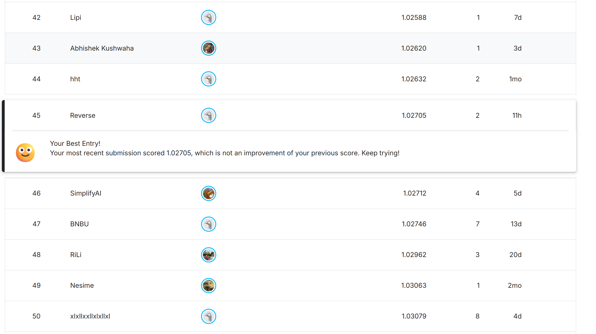

# LLM of kaggle competition

**preface**：根据Chatbot Arena的两个模型比较来评分，比如有两个模型model a，model b，为了比较两个模型的输出回答优劣，会有许多用户进行提问问题，之后根据两个模型输出回答选择更好（因为只要不是错误的乱回答，与其说是更好，不如说是更偏好哪种回答），model a更好？model b更好？model a与model b平局？本次目标就是设计一个自动评分偏好的模型，能够根据用户提示词，model a与model b的输出回答进行得出上述三种结果。因为用户提示词、model a、model b的回答都是自然语言序列，都是文本表示，所以其实有许多解决方案。但是鄙人目前只想采取两种方案。一种是利用传统的**NLP编码器**，一种是直接微调现代**大模型**。其实关于这些方案，很大的一个问题就是显存问题。

实验环境：kaggle平台，使用的卡为GPU T4*2（Turing 架构，具有Tensor Cores），本次实验并未使用GPU P100（Pascal 架构）。

## 1.NLP Encoder（DeBERTa）

​	把prompt、model a的回答、model b的回答拼在一起输入DeBERTa，之后输出一个高度浓缩的特征向量，再写一个全连接网络进行分类，把这个高度浓缩的特征向量输入进全连接神经网络，得到分类以及各自类别概率。

​	代码全是ai写的，我一点没写，我写不来代码，工程实践能力太弱了。我先快速跑通一个baseline，后面再优化各个问题。

### DeBERTa模型（deberta-v3-small）：


### Problem（思考与遇到的问题）日志:

1.如果顺序一直是提示词+a回答+b回答，截断的基本都是b回答的文本。误差很大。采取了提示词、model a回答、model b回答都要设置一个最长长度（比如分别最长长度为），都要截取。长度设置是采用的总数据里面随机选取1000条数据，之后看95%分位数那个位置的长度，之后确定的长度。

2.每次截断文本都是末尾，但是一般末尾才是总结，才是真的核心问题，那岂不是有很大概率把最重要的论点论据给截断了。这个问题目前不想解决，不能直接说把模型a、b的回答生成摘要吧，因为只要两个模型回答的都没错，只是风格和一些语气等与内容无关的回答不同，但是提问的主要内容、概要是一样的，那这样把模型a、b回答生成摘要区分度不大，更解决不了偏好的问题了。

3.使用了自动混合精度（AMP），提升了显存的利用率和降低了显存占用率。因为模型权重参数、梯度数据类型不一样，一个float16、一个float32遇到的问题，后面全部强制float32解决。

4.训练速度为1.02it/s，速度很慢，预估训练时间很长。那我应该使用断点保存，一步一步慢慢训练了。后面代码加了自动保存最优权重文件。

5.我其实第一遍没有看代码，只是大致看了一下，只是想着先速通。等会速通了后就让ai给我一段一段的解释代码吧。我看代码里面好像没有冻结DeBERTa的权重，怎么微调的？

6.此次在kaggle后台跑的时候，打开日志检查是否正常训练时，发现一打开正在训练跑的模型日志浏览器就卡死，原因是采用了**tqdm**进度条带来的DOM爆炸。只在前天盯着跑的时候，tqdm进度条会一直刷新（覆盖旧数字），但是提交到kaggle后台（save version & run all）时，kaggle的标准流输出变化，他不再覆盖上一行旧数据，而是直接每一个batch都要打印全新的一行。当我在浏览器查看后台训练的模型日志时，由于本次一个epoch有6400多个batch，kaggle会把这6400多行的日志一口气推送到我的浏览器，我的chrome需要瞬间创建成千上万个前端DOM节点进行渲染，所以本地浏览器的内存瞬间飙升，导致浏览器卡死。所以一般查看训练跑模型的日志时，最好使用多少批次printf出来，不要使用tqdm，当然你一直盯着跑那可以使用tqdm。

7.使用的GPU为T4*2，双卡并行一起跑的，每张卡跑半批次。

8.在该方案下，不改变方案的前提下，改进方法有k折交叉验证、学习率衰减等。

9.这里有一个坑，就是我是双卡训练的模型，所以模型权重文件使用的双T4卡训练保存的。在推理时，如果只使用了一张卡或者在CPU上做推理测试，Pytorch可能会因为找不到原来的GPU而报错。在torch.load()里面加上map_location=device，就会把权重映射到当前可用的设备上。

10.kaggle竞赛提交的notebook不能联网（也就是训练的时候随便联网，但是提交推理的时候禁止联网），而且最终也不是提交一个结果文件，而是提交一个notebook，kaggle后台会运行这个notebook。所以可以直接加载别人上传的model，也可以自己直接去下载model后，再本地上传到kaggle使用。提交后的滚动排行榜排名如图。



### Code（代码实验）：

关于代码中的疑问，为什么如此写代码？

#### 训练时coding：

1.attention mask代码片段如下，加入attention mask是为了让Transformer模型知道哪些token是真实内容，会去计算注意力。padding填充零的不参与注意力计算。DeBERTa（以及所有Transformer）在计算self-attention时会对整个序列（包括padding）都做计算，这样会把padding的token当成有意义的内容，导致注意力分数被污染、计算时间变长、训练不稳定，所以加了mask后，模型会把padding的位置当成无意义的内容，不参与计算注意力。而且一定需要padding补齐，因为模型需要batch内的形状一致。

```python
        # 4. 生成 Attention Mask (有真实 Token 的地方是 1)
        attention_mask = [1] * len(input_ids)
        
        # 5. Padding (填充到固定的最大长度)
        pad_length = self.total_max_len - len(input_ids)
        if pad_length > 0:
            input_ids = input_ids + [self.pad_token_id] * pad_length
            attention_mask = attention_mask + [0] * pad_length # 填充部分的 mask 为 0
```

2.特殊的token：[CLS]和[SEP]，是分词器tokenizer内置的特殊符号，作用如下表。

| 特殊 token | 代码里的写法        | 含义                           | 作用                                                         |
| ---------- | ------------------- | ------------------------------ | :----------------------------------------------------------- |
| **[CLS]**  | `self.cls_token_id` | **Classification**（分类标记） | 放在最开头，模型会把整个序列的信息浓缩到这个位置（后面就只需要取它做分类） |
| **[SEP]**  | `self.sep_token_id` | **Separator**（分隔符）        | 用来分割不同部分（Prompt / Response A / Response B）         |

代码手动拼接序列完整格式

```python
input_ids = [CLS] + prompt_tokens + [SEP] + A_tokens + [SEP] + B_tokens + [SEP]  #拼接提示词、模型A的回答、模型B的回答
```

3.代码是如何fine-tuning（微调）DeBERTa模型的？使用的全参数微调（Full Fine-Tuning），代码没有冻结任何层，所以DeBERTa模型的每一层权重在反向传播时都会变化调整。整个网络结构只是在DeBERTa模型后面加了一个分类头（一层的全连接神经网络，不包括输入层，输出层不加激活函数，输出logits）。

#### 推理时coding：

1.

### 改进：

1.

## 2.大模型LoRA微调（Llama）

​	本次骨干网络（backbone）采用的Meta的开源Llama-3-8B（8B，8Billion，80亿），采取骨干网络+分类头策略，因为最简单，取大模型底层最后一层、最后一个token，最后接一个分类头。

​	毕竟使用的实验环境显卡为GPU T4*2，一共32G显存，微调80亿的部分参数。因为该模型有80亿的全量参数，如果按照FP16（16位浮点数，其实16位浮点数精度不高）加载进入显卡里

$1GB=1024MB=1024*1024KBytes=1024*1024*1024Bytes$

$(8*10^9*2Bytes)/1024*1024*1024=14.9G=>16G（近似）$

直接干到16GB（一张单卡16G）了，直接显存爆炸，不现实，而且这里还只是算静态加载参数进来，在训练阶段还会有许多中间变量存储（梯度反向传播时梯度值、优化器状态、中间激活值），输入数据的显存占用还没加上，会需要占用更多显存，并且这里还是采用的精度不是很高的FP16类型数据存储。所以必须采取某些技术冻结大部分参数，微调部分参数。

​	本次使用QLoRA（Quantized Low-Rank Adaptation ）：第一，4-bit压缩，把原本的16位权重压缩成4位，显存占用能大幅降低，不过精度嘛就可能稍微弱势一点。第二，8B参数全部冻结不更新，在大模型每一层旁边加一个旁路网络，只训练这个旁路网络和分类头的全部参数。第三，梯度检查点，使用计算时间换显存空间的常用方法，不保存训练中间过程的激活值，反向传播需要更新的时候再重新算。


### Llama模型（Llama-3-8B）

1.

### Problem（思考与遇到的问题）日志：

1.Meta官网的llama-3-8b需要签许可协议才能使用他的开源模型，我在官网找了好久，发现有些签许可的链接全是404失效的。今天下午（3/11/2026）就这个许可就捣鼓了几十分钟，实在没在kaggle和meta官网解决，要么只能取hugging face下载模型之后上传到kaggle了，但是我采取的是一定有人上传了这个模型在kaggle上并公开了，所以直接在kaggle上搜索别人上传并公开的llama3。

2.代码问题，在hugging face框架下加上device_map="auto"，面对大模型，单张卡装不下时，双卡可以一起装，即GPU 0装模型的上半部分，GPU 1装模型的下半部分，是流水线并行（Pipeline Parallelism，也叫模型并行）模式，单进程。本次实验实测速度为0.02it/s。这样会造成数据输入时，GPU 0先算，GPU 1等着，GPU 0算完了再把中间结果传到GPU 1，GPU 1再开始计算，GPU 0又等着，两张卡都用了，但是同时只有一张卡在计算训练，而且卡与卡之间的传输数据通信延迟还需要耗费大量时间，造成训练模型速度更慢，不过这样确实是用了时间换空间。

3.而数据并行（Data Parallel，DP）速度快很多。两张卡GPU 0与GPU 1分别装一个完整的模型，然后把一个batch的数据分成两半，每张卡同时跑半个batch（完整batch的一半，比如batchsize=64，两张卡分别跑32个样本），速度快很多（翻倍），所以对于单张卡有余量，且对于输入数据、中间过程数据有空间，可以采用数据并行。

4.但是分布式数据并行（Distributed Data Parallel，DDP）速度更快，Pytorch官方文档都有这样一句话“DataParallel is deprecated and we strongly recommend using DistributedDataParallel instead”。DDP与DP相同点都是把一个模型完整的复制到每张卡上，每张卡均摊一个完整的批次。其实DP相当于“单进程+多线程”（Pytorch内部开多个线程，进行Python操作时还是每张卡互相抢着轮流用python操作，并未真正的并行），而DDP是“多进程”（会启动卡数量个完全独立的Python进程，进程之间互不干扰，每张卡互相独立的使用Python操作，实现并行）。其实DP与DDP最根本的区别就是梯度平均（汇总）的方式不一样。DP与DDP异同（设一台机器两张卡（单机多卡），batchsize=64）：

| 任务           | DP (DataParallel)                                            | DDP (DistributedDataParallel)                                |
| -------------- | ------------------------------------------------------------ | ------------------------------------------------------------ |
| 每张卡算什么？ | 各算一半 batch（32 个样本）                                  | 各算一半 batch（32 个样本）                                  |
| 梯度怎么平均   | 全部梯度**集中到第 0 张卡**求平均，再广播回去，每张卡再梯度更新 | 两张卡**直接互相通信**（AllReduce），互相拿到对方的梯度，之后各自梯度反向更新 |
| 复制模型时     | 每次前向传播都要重新复制（每一步训练都要重复这个操作）       | 启动时只复制一次，复制到每个进程                             |

综上，DDP速度比DP速度快一点（当然定性分析是这样）。

5.数据并行DP的方式，删掉了device_map="auto"这行代码，Pytroch原生的DP与4-bit量化冲突了（内存地址错乱），输出报错信息如RuntimeError: CUDA error: CUBLAS_STATUS_EXECUTION_FAILED when calling `cublasGemmEx( handle, opa, opb, m, n, k, alpha_ptr, a, CUDA_R_16F, lda, b, CUDA_R_16F, ldb, beta_ptr, c, std::is_same_v<C_Dtype, float> ? CUDA_R_32F : CUDA_R_16F, ldc, compute_type, CUBLAS_GEMM_DEFAULT_TENSOR_OP)`。后面不得已使用单卡微调训练了，指定一张单卡微调训练。

6.使用的Unsloth+单卡微调训练。一个加速微调训练Llama-3的开源库，Unsloth使用了C++和Triton重写了Llama-3的底层数学计算（注意力机制和LoRA运算），成功使用了Unsloth，不过速度确实增长了两倍，但是还是太慢了，要想微调训练我本次的模型，所化的时间太长，马上更换方案，采取TPU v5-8显卡。

7.
